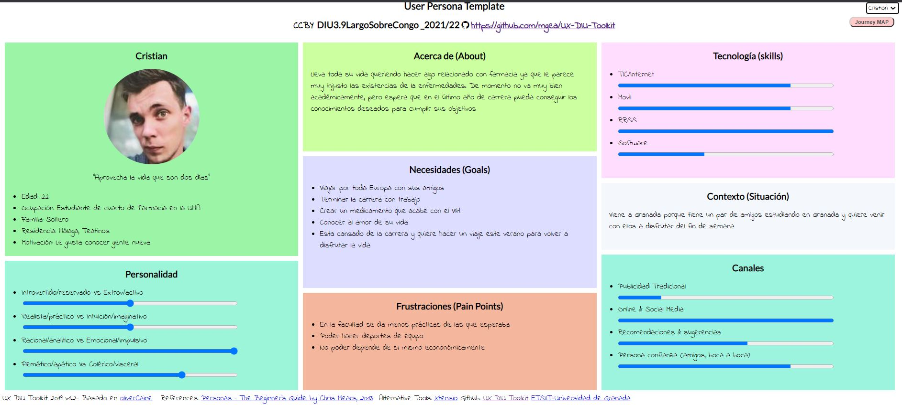
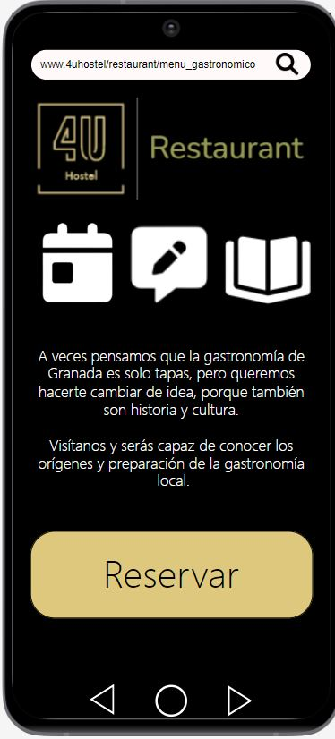
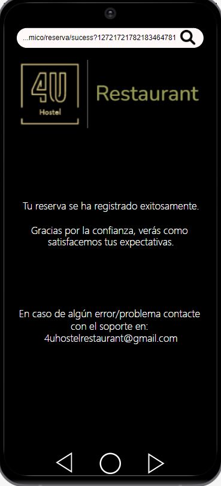
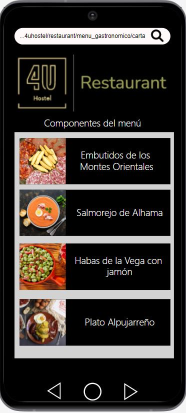

# DIU22
Prácticas Diseño Interfaces de Usuario 2021-22 (Tema: Hostels) 

Grupo: DIU9_LargoSobreCongo.  Curso: 2021/22 
Updated: 19/5/2022

Proyecto: 
Menú Gastronómico de Granada - 4U Hostel

Descripción: 

Decidimos desarrollar un  menú gastronómico de la comida típica de la provincia para sacarle su 
máximo potencial y atraer a más clientes a visitar Granada. El microsite ofrece
los servicios típicos: reserva, consultar carta, además de poder conocer un poco
más la cultura e historia de los platos.

Logotipo: 
Logo:

Miembros
 * :bust_in_silhouette:  Álvaro Vega Romero     :octocat:     
 * :bust_in_silhouette:  David Correa Rodríguez     :octocat:

----- 

# Proceso de Diseño 

## Paso 1. UX Desk Research & Analisis 

 1.a Competitive Analysis
-----

Seleccionamos aquellos hostels que eran similares al 4U Hostel (respecto a valoración) y ubicación, pero que tuvieran
ciertas diferencias de diseño y servicios.
Elegimos: Broz Hostel, Oh! My Hostel y 4U Hostel.
Podemos destacar que:
- Broz Hostel tiene más facilidades y servicios que 4U
- Oh! My Hostel presentaba dificultades e inconsistencias en la navegación,
además de un diseño visual mejorable.
- 4U presenta algunos bugs visuales y el despliegue de los servicios que ofrece no están
en un sitio adecuado. No dispone de seccion FAQs.

 1.b Persona
-----

Quisimos seleccionar personas con perfiles diferentes para poder abarcar más posibilidades
en la experiencia de usuarios del hostel.
- Cristian: estudiante, vividor, sociable.
- Paco: anciano, inexperto, ganas de viajar.

 1.c User Journey Map
----

Decidimos jugar con ese concepto de que eran usuarios diferentes:
- Crisitan es joven y está acostumbrado a las tecnologías y a este tipo de aventuras, por lo
que su experiencia de usuario sería previsiblemente buena.
- Paco es un anciano inexperto y torpe con las tecnologías, por lo que previsiblemente iba a tener
una experiencia de usuario mala.

Cristian es un usuario bastante común en estas situaciones (vacaciones, escapada). Paco es menos común, aunque
es cierto que la tercera edad es cuando más tiempo disponible se tiene para hacer otras actividades como,
por ejemplo, viajar y hospedarse.

 1.d Usability Review
----

- Enlace al documento: https://github.com/wastedDavid/DIU/blob/master/P1/Usability-review-template.xls
- Valoración final (numérica): 82
- Comentario sobre la valoración:  En general, es accesible para todos los tipos usuarios, pero un poco
tosca para aquellos con conocimientos básicos de web. Interfaz atractiva aunque con algunos defectos
de tamaños y cambios de pantalla / zooms.

## Paso 2. UX Design  

 2.a Feedback Capture Grid / EMpathy map / POV
----

Interesantes | Críticas
------------ | ----------------
| Instalaciones visualmente atractivas. | Las habitaciones podrían ser un poco más grandes y disponer de una pequeña cocina para cocinar. |
| Habitaciones rústicas bonitas. | Tardaron en responder al teléfono, podrían estar más atentos o disponer de varios teléfonos (en la web solo aparece 1) |
| Facilidad de reserva y de ver las posibles habitaciones para esta. | No se puede pagar en efectivo (en la reserva se pide una tarjeta) ni tampoco después de la estancia. |
| Página más bonita y completa que la competencia. |
| Situado en pleno centro de Granada. |

Preguntas | Nuevas ideas
------------ | ----------------
| ¿Hay aparcamiento? | Que las secciones de la página  no aparezcan cortadas por el encabezado. |
| ¿Algún lugar que describa las actividades que tienen? | Tener habitaciones sin literas (pareja de ancianos no se ven capaces de subir a una litera) e individuales. |
| ¿Qué tiene alrededor? Hay paradas de autobús, tiendas, monumentos? | Poder pagar después de la estancia y en efectivo. |
| ¿Se puede ir con mascotas? |
| ¿Hay zonas de ocio cercanas? |

  
    
El problema que planteamos es que 4U Hostel no ofrecía un lugar de comida
o restaurante formal en donde sus huéspedes tomaran o comieran durante su estancia.

Planteamos la hipótesis de que, si se incluyera este servicio, incentivaría más
a querer hospedarse en el local, quedarse más tiempo, no depender de otros servicios
externos además de ofrecerle a los clientes conocimientos y cultura general de la 
gastronomía de Granada, haciéndolo emblemático y exclusivo.

 2.b ScopeCanvas
----

 2.b Tasks analysis 
-----

 2.c IA: Sitemap + Labelling 
----

Término | Significado     
------------ | ----------------
| Menú | Redirige a una página de información general acerca del restaurante y del menú |
| Sobre nosotros | Redirige a la página de información de la empresa / negocio |
| Contactar | Redirige a la página de contacto de la empresa / negocio |
| Carta | Redirige a la página de los platos ofertados con su información asociada, como alérgenos, precios, ingredientes y fotos (mediante categoría Carta y mediante galería de fotos)|
| Reservar | Redirige a la página para hacer una reserva en el restaurante (botón Reservar y categoría Reservas) |
| Opiniones | Redirige a una página con las opiniones escritas acerca del restaurante, además de poder redactar (categoría Opiniones) |

 2.d Wireframes
-----

Hicimos un planteamiento para Web, pero en la práctica 3 reflexionamos sobre ello
y llegamos a la conclusión de que iba a ser un servicio más accedido a través de movil
por su rapidez y comodidad de hacerlo por teléfono.

Inicialmente se mostraría la portada. Desde ahí, se podría acceder a la reserva
o a la carta, además del resto de términos explicados en el Labelling.
Se accedería mediante los botones/enlaces explicados en el Labelling.

Un ejemplo de navegación sería: Portada -> Carta -> Volver a Portada -> Reservar

Parte de la portada

Parte de la carta

Parte de la reserva

## Paso 3. Mi UX-Case Study (diseño)

 3.a Moodboard
-----

Decidimos usar los mismos tres colores básicos que la página original para seguir con la estética. Decidimos usar
unas tipografías finas en concordancia con las fuentes utilizadas en el Hostel. Creamos un eslogan corto pero atractivo,
e iconos intuitivos y simples.

La herramienta que hemos utilizado para el logo ha sido draw.io. Hemos partido del logo inicial y le hemos añadido a la derecha otro recuadro negro
con la palabra "Restaurant", con la tipografía y los colores del moodboard para no romper con la estética original.
El logo sí se podría utilizar en la cabecera de Twitter, al tener una resolución adecuada.

  3.b Landing Page
----

En el landing page destacar que lo importante (logo y botón de reservar) se puso en la parte central de la pantalla para 
darle más importancia y recalcarlo. A los lados se pusieron algunas imágenes para clarificar aún más que se trata
de un restaurante.

 3.c Guidelines
----

Después de reflexional al respecto, decidimos crear un diseño de móvil ya que pensamos que los clientes
accederían con mayor frecuencia desde el móvil más que desde un ordenador (al ser un sitio de paso o un sitio
que se usa en un corto periodo de tiempo)

Usaremos los patrones para el “Getting input” para la parte de introducir los datos para la reserva. Vemos otros patrones para la parte de navegación como “module tabs” para separar las distintas páginas que puede tener nuestra web.

Respecto a Guidelines, al final vamos a hacer la web, pero vista desde un dispositivo móvil Android. Por tanto, seguiremos las guías aportadas por material.io para una vista desde un dispositivo móvil.

  3.d Mockup
----

Si se desea probar el prototipo en vivo:

https://cloud.protopie.io/p/abcc49bb05?touchHint=true&ui=true&scaleToFit=true&cursorType=touch&mockup=true&bgColor=%23F5F5F5&playSpeed=1&playerAppPopup=true

En la portada añadimos los iconos principales que redirigirán a las funcionalidades principales
(reserva, opiniones -no implementado-, y carta).

## Paso 4. Evaluación 

 4.a Caso asignado
----

DIU3_08 JavierNuñezMiguelMedina (JNMN)
Microsite que facilita el acceso a toda la información del restaurante,  proporcionando el menú y ofertas exclusivas para la gente del hostal.

https://github.com/miguemedina11/DIU

 4.b User Testing
----

Respecto los resultados del role-play:
Este personaje ficticio será luego representado por mi madre (Maite), ama de casa, casada, madre de 2 hijos. Experiencia intermedia en internet al haber adquirido ordenador y teléfono móvil (Android) con conexión a internet a mediana edad.
Es una mujer risueña que disfruta de la compañía de sus seres queridos. Las necesidades de cara a la aplicación es poder consultar el menú disponible y, de paso, poder reservar en el sitio.

Este personaje ficticio será luego representado por mi madre (Inmaculada - Madre de Álvaro) ya que ella comparte muchas características con el rol creado (poca experiencia en internet, adulta, ocupada, y sorprendida según el momento). Sus necesidades respecto a la APP son obvias, y es simplemente, poder saber que puede comer en el menú y reservar un día para poder probarlo.

El resultado de este rol, será representado por mi el hermano de Álvaro ya que el resultado fue un joven estudiante el cual está triste por los exámenes. Respecto a sus necesidades, son salir a un restaurante con sus amigos para celebrar el fin de exámenes y disfrutar por el centro de Granada 

Amigo de David
Este personaje ficticio será luego representado por mi amigo (Daniel), un joven de 21 años actualmente trabajando con ganas de volver a la Universidad. Frustrado por el trabajo, sus necesidades respecto a la aplicación es comer rápidamente en el sitio ya que le pillaba de paso después de salir de la jornada laboral.
 

| Usuarios | Sexo/Edad     | Ocupación   |  Exp.TIC    | Personalidad | Plataforma | TestA/B
| ------------- | -------- | ----------- | ----------- | -----------  | ---------- | ----
| Madre de David  | F/45-60   | Ama de casa  | Intermedia       | Adulto, Trabajando, Feliz | Android   | A 
| Madre de Álvaro  | F/45-60   | Abodada  | Baja       | Adulto, Trabajando, Sorprendida | Android      | A 
| Hermano de Álvaro  | M/15-30   | Estudiante     | Avanzada        | Joven, Estudiando, Triste | Apple    | B 
| Amigo de David  | M/15-30   | Empleado en limpieza  | Avanzada       | Joven, Trabajando, Enfadado| Android | B 

. 4.c Cuestionario SUS
----

Respecto a las conclusiones que sacamos después de ver los resultados de los cuestionarios son para 
- 4U Restaurant (caso A): el prototipo cumple las expectativas, por tanto, hemos conseguido que todo tipo de usuarios pueda ser capaz de usar la aplicación web, independientemente de su experiencia previa. La aplicación es simple, consistente y fácil de usar que como dije, era nuestro objetivo. Destacamos el resultado, siendo mejor valorada nuestra aplicación web.

- Food4U (caso B): el prototipo cumple con los requisitos y funcionalidades básicas. Respecto al menú de navegación no contiene demasiados elementos y la navegación por las distintas páginas es correcta. Presenta iconos y textos intuitivos que hacen al usuario poder cumplir el objetivo sin muchas complicaciones y de forma sencilla. Algo a tener en cuenta y que es mejorable es la portada de la web, que consideramos que está un poco cargada de texto, haciendo que sea más compleja y menos limpia la web. Por lo demás, y en general, presenta una apariencia y funcionalidad muy correcta.

 4.d Usability Report
----

https://github.com/wastedDavid/DIU/tree/master/P4/Usability_Report-JNMN

El prototipo cumple con los requisitos y funcionalidades básicas. Respecto al menú de navegación no contiene demasiados elementos y la navegación por las distintas páginas es correcta. Presenta iconos y textos intuitivos que hacen al usuario poder cumplir el objetivo sin muchas complicaciones y de forma sencilla. 

Algo a tener en cuenta y que es mejorable es la portada de la web, que consideramos que está un poco cargada de texto, haciendo que sea más compleja y menos limpia la web. 

Por lo demás, y en general, presenta una apariencia y funcionalidad muy correcta.

## Conclusión final / Valoración de las prácticas

Las prácticas en general han sido bastante interesantes ya que nos han hecho ver como las interfaces de usuario son más importatantes de lo que inicialmente pensábamos. Hemos aprendido también acerca de como el usuario piensa y actúa frente a diferentes aplicaciones y webs.
Muy buenas prácticas, no cambiaríamos nada a rasgos generales. 

